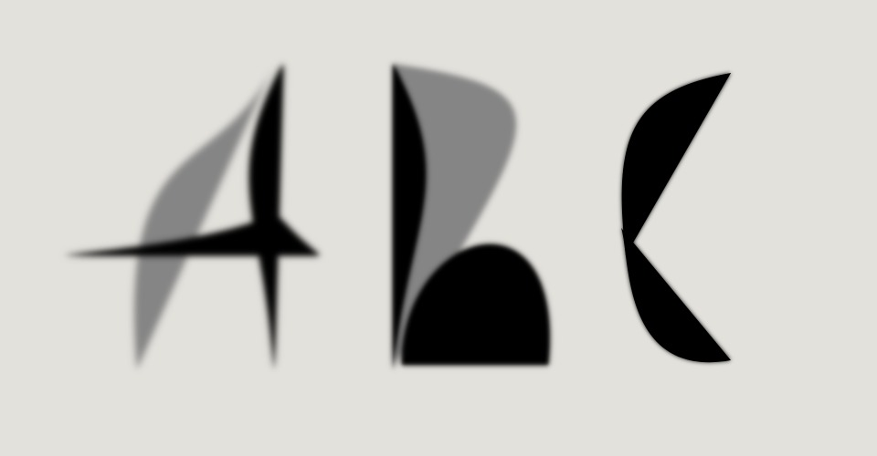

## MDDN 242 2024 Assignment 2

## Font Name: InkPoint
## Name: Evelyn Lee

_____________________________________________________________________________________________________
#### Design Intention:

The initial inspiration for this font was based on Chinese calligraphy for its simple and bold ink strokes that make up each character. Near the beginning, I wanted to recreate these inky brush strokes as if they were drawn on semi-transparent paper with the ink bleeding through leaving a blurry shadow on the otherside. However, due to parameter constraints I simplified this design by scrapping the blur effect and limiting to 3 main shapes. This ended up giving the font a more modern feel yet still keeps the bold and sharp resemblence of calligraphy writing.

_____________________________________________________________________________________________________
#### Progress:  

Mid-way through the project, I realized it would be difficult to replicate the style accurately due to the given parameter limit. Since I was using bezier vertex shapes to create the ink strokes, I would have to use a larger amount of parameters if I wanted to replicate the varying bends. 

Because of this, I had to cut down the amount of shapes I'm using as well as any extra vertices. This leaves 3 main shapes each with 8 parameters.

I couldn't quite work out how to get the blur filter working the way I wanted it to and since I was running out of time I decided to not include the idea.

I didn't have much of a plan in mind for each character but I tried sticking to varying positions of each shape as well as keeping the overall font mostly readable.

Due to a personal matter that has affected the process of this assignment, I couldn't quite get the outcome I had hoped to achieve. Some letters don't line up well as the others nor did I get to fiddle more with the interpolations of the transitions. Despite these mishaps, I don't fully dislike what I ended up with and still am satisfied with how it turned out.
_____________________________________________________________________________________________________
#### The 24 parameters per letter:

Parameters for first bezier vertex shape
  * `offsetx` : x position of first vertex point
  * `offsety` : y position of first vertex point
  * `tailoffsetx`: x position of second vertex point
  * `tailoffsety`: y position of second vertex point
  * `bulkoffsetx`: x position of upper mid vertex point
  * `bulkoffsety`: y position of upper mid vertex point
  * `midoffsetx`: x position of lower mid vertex point
  * `midoffsety`: y position of lower mid vertex point

Parameters for second bezier vertex shape
  * `2offsetx`: x position of first vertex point
  * `2offsety`: y position of first vertex point
  * `2tailoffsetx`: x position of second vertex point
  * `2tailoffsety`: y position of second vertex point
  * `2bulkoffsetx`: x position of upper mid vertex point
  * `2bulkoffsety`: y position of upper mid vertex point
  * `2midoffsetx`: x position of lower mid vertex point
  * `2midoffsety`: y position of lower mid vertex point

Parameters for third/shadow bezier vertex shape
  * `soffsetx`: x position of upper mid vertex point
  * `soffsety`: y position of upper mid vertex point
  * `stailoffsetx`: x position of first vertex point
  * `stailoffsety`: y position of first vertex point
  * `sbulkoffsetx`: x position of second vertex point
  * `sbulkoffsety`: y position of second vertex point
  * `smidoffsetx`: x position of lower mid vertex point
  * `smidoffsety`: y position of lower mid vertex point
